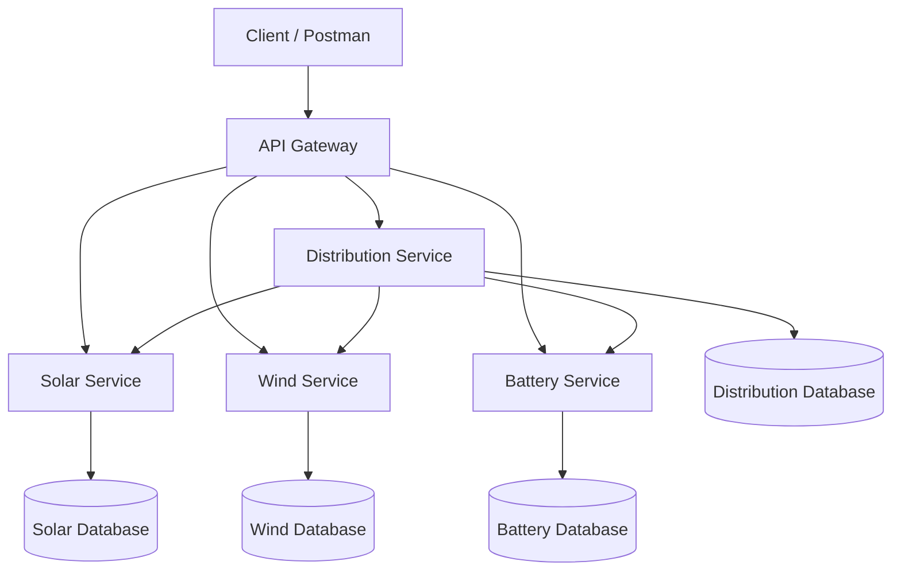
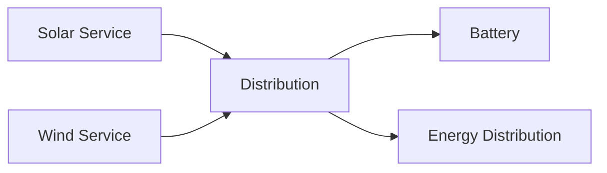

# 🌱 Renewable Energy Monitoring System

<p align="center">


</p>

> ⚡ A **Microservices-Based Renewable Energy Monitoring System** built using **Java 17**, **Spring Boot**, **Spring Data JPA**, **MySQL**, and **Spring Cloud Gateway**. The system monitors renewable energy generation from solar panels and wind turbines, intelligently stores excess energy in batteries, distributes energy based on demand, detects equipment faults, and generates daily reports.

---

# 📚 Table of Contents

- [Overview](#-overview)
- [Project Highlights](#-project-highlights)
- [System Architecture](#-system-architecture)
- [Technology Stack](#-technology-stack)
- [Microservices](#-microservices)
- [Project Structure](#-project-structure)
- [Business Workflow](#-business-workflow)
- [API Endpoints](#-api-endpoints)
- [Database Architecture](#-database-architecture)
- [Validation](#-validation)
- [Exception Handling](#-exception-handling)
- [Installation](#-installation)
- [Running the Project](#-running-the-project)
- [Future Enhancements](#-future-enhancements)
- [Author](#-author)

---

# 📖 Overview

The Renewable Energy Monitoring System simulates how a renewable energy company manages electricity generated from **Solar Panels** and **Wind Turbines**.

The platform is developed using **Spring Boot Microservices**, where each service is independently deployed and maintains its own database.

The Distribution Service communicates with Solar, Wind, and Battery services using **RestTemplate** to balance the energy requirements of the company.

---

# ✨ Project Highlights

- ☀️ Solar Panel Management
- 💨 Wind Turbine Management
- 🔋 Battery Storage Management
- ⚡ Intelligent Energy Distribution
- 📊 Daily Energy Reports
- 🚨 Automatic Fault Detection
- 🌐 API Gateway
- 🔄 Inter-Service Communication using RestTemplate
- 🗄️ Database per Microservice
- ✅ Bean Validation
- ⚠️ Global Exception Handling

---

# 🏗️ System Architecture



---

# 🛠 Technology Stack

| Category | Technology |
|-----------|------------|
| Language | Java 17 |
| Framework | Spring Boot |
| Database | MySQL |
| ORM | Spring Data JPA, Hibernate |
| Build Tool | Maven |
| Communication | REST APIs |
| Gateway | Spring Cloud Gateway |
| Mapper | MapStruct |
| Validation | Jakarta Validation |
| Boilerplate Reduction | Lombok |

---

# 🧩 Microservices

| Service | Port |
|----------|------|
| API Gateway | 8080 |
| Solar Service | 8081 |
| Wind Service | 8082 |
| Battery Service | 8083 |
| Distribution Service | 8084 |

---

# 📁 Project Structure

```
Renewable-Energy-Monitoring-System
│
├── api-gateway
│
├── solar-service
│
├── wind-service
│
├── battery-service
│
└── distribution-service
```

---

# ⚙️ Business Workflow



### Distribution Logic

1. Solar and Wind services generate renewable energy.
2. Distribution Service calculates the total renewable energy.
3. If renewable energy is sufficient:
   - Company demand is satisfied.
   - Remaining energy is stored in available batteries.
4. If renewable energy is insufficient:
   - Batteries are discharged to satisfy the remaining demand.
5. Every distribution transaction is stored in the Distribution Service.

---

# 🚀 Features

## ☀️ Solar Service

- Register Solar Panels
- Update Panel Details
- Delete Panels
- Record Hourly Generation
- View Generation History
- Daily Energy Reports
- Fault Detection
- Input Validation
- Global Exception Handling

---

## 💨 Wind Service

- Register Wind Turbines
- Update Turbine Details
- Delete Turbines
- Record Hourly Generation
- View Generation History
- Daily Energy Reports
- Fault Detection
- Input Validation
- Global Exception Handling

---

## 🔋 Battery Service

- Register Batteries
- Charge Battery
- Discharge Battery
- Battery Percentage
- Battery Status
- Low Battery Alert
- Battery History
- Validation
- Exception Handling

---

## ⚡ Distribution Service

- Renewable Energy Calculation
- Automatic Battery Charging
- Automatic Battery Discharging
- Distribution History
- Skip Maintenance Equipment
- RestTemplate Communication

---

# 📡 API Endpoints

## Solar Service

| Method | Endpoint |
|---------|----------|
| POST | /api/v1/solar-panels |
| GET | /api/v1/solar-panels |
| GET | /api/v1/solar-panels/{id} |
| PUT | /api/v1/solar-panels/{id} |
| DELETE | /api/v1/solar-panels/{id} |
| POST | /api/v1/solar-panels/{id}/generation |
| GET | /api/v1/solar-panels/report |
| GET | /api/v1/solar-panels/faults |

---

## Wind Service

| Method | Endpoint |
|---------|----------|
| POST | /api/v1/wind-turbines |
| GET | /api/v1/wind-turbines |
| GET | /api/v1/wind-turbines/{id} |
| PUT | /api/v1/wind-turbines/{id} |
| DELETE | /api/v1/wind-turbines/{id} |
| POST | /api/v1/wind-turbines/{id}/generation |
| GET | /api/v1/wind-turbines/report |
| GET | /api/v1/wind-turbines/faults |

---

## Battery Service

| Method | Endpoint |
|---------|----------|
| POST | /api/v1/batteries |
| GET | /api/v1/batteries |
| GET | /api/v1/batteries/{id} |
| PUT | /api/v1/batteries/{id} |
| DELETE | /api/v1/batteries/{id} |
| POST | /api/v1/batteries/{id}/charge |
| POST | /api/v1/batteries/{id}/discharge |
| GET | /api/v1/batteries/{id}/percentage |
| GET | /api/v1/batteries/{id}/status |

---

## Distribution Service

| Method | Endpoint |
|---------|----------|
| POST | /api/v1/distribution/balance |
| GET | /api/v1/distribution |
| GET | /api/v1/distribution/{id} |

---

# 🗄️ Database Architecture

Each microservice owns its own database.

```
Solar Service
      │
      └── Solar Database

Wind Service
      │
      └── Wind Database

Battery Service
      │
      └── Battery Database

Distribution Service
      │
      └── Distribution Database
```

This follows the **Database per Microservice** pattern.

---

# 📋 Business Rules

- Renewable energy is always prioritized.
- Excess energy is stored in batteries.
- Batteries are used only when renewable energy is insufficient.
- Batteries never exceed their capacity.
- Batteries never discharge below zero.
- LOW BATTERY alert is generated when battery percentage is ≤ 20%.
- Devices under maintenance are excluded from distribution.
- Active devices with zero generation are reported as faulty.

---

# ✔️ Validation

The project validates:

- Device Name
- Capacity
- Generation Units
- Battery Percentage
- Location
- Status

using **Jakarta Bean Validation**.

---

# ⚠️ Exception Handling

Custom exceptions include:

- SolarPanelNotFoundException
- WindTurbineNotFoundException
- BatteryNotFoundException
- DistributionException
- FaultDetectionException
- InvalidBatteryPercentageException

All exceptions are handled using a centralized **Global Exception Handler**.

---

# 💻 Installation

Clone the repository.

```bash
git clone https://github.com/<your-username>/renewable-energy-monitoring-system.git
```

Navigate to the project.

```bash
cd renewable-energy-monitoring-system
```

Create the required MySQL databases.

Configure the database credentials in each service's `application.yml`.

---

# ▶️ Running the Project

Start the services in the following order:

1. MySQL
2. Solar Service
3. Wind Service
4. Battery Service
5. Distribution Service
6. API Gateway

All requests should be sent through:

```
http://localhost:8080
```

---

# 🔮 Future Enhancements

- JWT Authentication
- Docker
- Kubernetes
- Eureka Service Discovery
- Resilience4j Circuit Breaker
- Prometheus & Grafana
- CI/CD Pipeline
- Email Notifications
- Real-Time Monitoring Dashboard

---

# 👨‍💻 Author

**Elavarasan M**


---

# ⭐ Support

If you found this project useful, consider giving it a ⭐ on GitHub.

---

# 📄 License

This project is developed for educational purposes and demonstrates the implementation of a Microservices-Based Renewable Energy Monitoring System using Spring Boot.